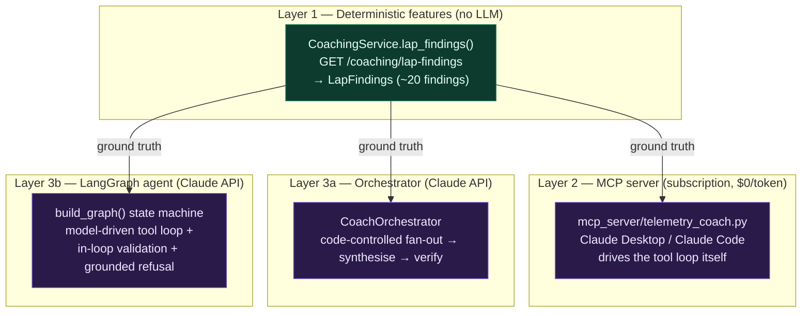
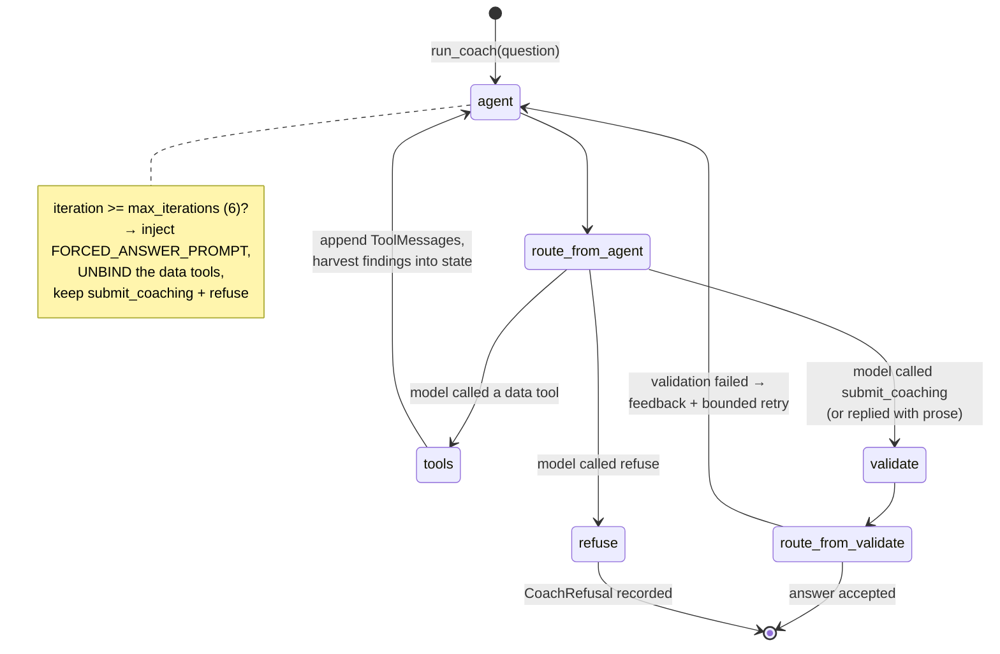
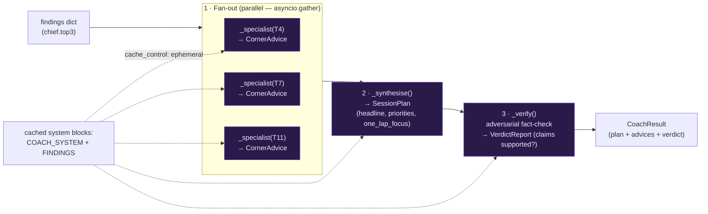
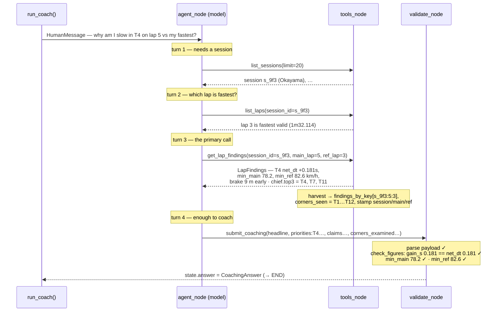

# AI / LLM Flow

How the coaching AI actually works end-to-end: the layers, the LangGraph state
machine, every tool call and its parameters, and a fully worked example traced
through the graph.

This complements [`COACHING.md`](./COACHING.md) (which explains *why* the design
is tiered). This document is the *flow* — the boxes, arrows, and payloads.

---

## 1. The three AI surfaces

There is no single "the LLM". There are three surfaces that share **one** piece
of ground truth — the deterministic `LapFindings` model (~20 findings, a few KB,
no raw 60 Hz telemetry).



| Layer | Entry point | Who drives the tool calls | Termination |
|---|---|---|---|
| **3b LangGraph agent** | `rtv.coaching.agent.run_coach()` | The **model** (agentic loop) | `submit_coaching`, forced-final, or `refuse` |
| **3a Orchestrator** | `CoachOrchestrator.coach()` | **Code** (fixed pipeline) | After the verify step returns |
| **2 MCP server** | `mcp_server/telemetry_coach.py` | **Claude Desktop/Code** | Human ends the chat |

The rest of this doc details **3b** (the graph — this is the "orchestrator /
LangGraph" you were picturing) and then **3a** (the multi-agent pipeline).

---

## 2. Layer 3b — the LangGraph state machine

Source: `src/rtv/coaching/agent/graph.py`. State: `src/rtv/coaching/agent/state.py`
(`CoachState`). Built by `build_graph(model, executor)`, run by `run_coach()`.

### 2.1 The graph



### 2.2 The four nodes

**`agent_node`** — the one LLM call per turn.
- Prepends `SYSTEM_PROMPT` (epistemic policy: *every figure must come from a tool
  result; refusal is a correct outcome*).
- Binds tools = `executor.definitions()` (the 5 data tools) **plus** the two
  virtual tools `submit_coaching` and `refuse`.
- **Forced-final termination:** once `iteration >= max_iterations` (default `6`),
  it injects `FORCED_ANSWER_PROMPT` and binds **only** `submit_coaching` + `refuse`
  (data tools unbound) — the loop *must* resolve. This is engineered termination,
  not hoped-for.
- Calls `model.bind_tools(tools).invoke([SystemMessage, *history]) -> AIMessage`.

**`route_from_agent`** (conditional edge) reads the last message's `tool_calls`:

| Tool the model called | Route to |
|---|---|
| `submit_coaching` | `validate` |
| `refuse` | `refuse` |
| any data tool (`list_sessions`, …) | `tools` |
| *nothing / prose* | `validate` (turned into feedback) |

**`tools_node`** — executes every requested data tool via `CoachToolExecutor`,
appends a `ToolMessage` per call, and **harvests the trace** into state:
- `get_lap_findings` result → stored in `findings_by_key["{session}:{main}:{ref}"]`
  (this dict is the validator's ground truth); corner labels → `corners_seen`;
  `session_id/main_lap/ref_lap` stamped from the payload.
- `list_available_channels` result → `channels_available` (what a refusal may cite).
- Then edges **back to `agent`** — the tool-calling cycle.

**`validate_node`** — the grounding gate for `submit_coaching`:
1. Parse args into `CoachingAnswerPayload` (Pydantic). Schema itself enforces
   `citations` is non-empty and every cited corner was examined.
2. `check_figures(...)` (`agent/validation.py`) compares **every cited figure
   against the findings actually retrieved**: a `net_dt` gain must match within
   `0.05 s`; `min_main`/`min_ref` within `0.5 km/h`; an unknown corner = hallucination.
3. **Pass** → build `CoachingAnswer` (model payload + code-known
   `session_id/main_lap/ref_lap`), set `state.answer`, → `END`.
4. **Fail** → append `VALIDATION_FEEDBACK_TEMPLATE` feedback and loop back to
   `agent` (bounded by `max_validation_retries = 2`). After exhaustion →
   `degraded_answer()` (an honest "could not determine", never a crash or a guess).

**`refuse_node`** — builds a `CoachRefusal`. The `channels_available` list is
filled by **code** from a tool result / the provider — never the model's
self-knowledge. → `END`.

### 2.3 Outcome

Exactly one of `state.answer` (`CoachingAnswer`) or `state.refusal`
(`CoachRefusal`) is set at `END`, and `state.tools_called` / `corners_seen` /
`findings_by_key` are the replayable provenance.

---

## 3. Tool call reference (exact names & parameters)

The graph advertises these to the model via `executor.definitions()`. The
descriptions are deliberately parallel to the Layer-2 MCP server. Input models
live in `src/rtv/coaching/agent/registry.py`.

### 3.1 Data tools (model-callable, cost order — cheap orienting calls first)

| Tool | Parameters | Returns | When |
|---|---|---|---|
| `list_sessions` | `limit: int = 20` (1–100) | `{sessions: [{session_id, kind, car_id, track_id, track_name, label, started_at}]}` | First — discover sessions |
| `list_laps` | `session_id: str` | `{session_id, laps: [{lap, time, valid, …}]}` | Pick a main lap + a faster reference |
| `list_available_channels` | `session_id: str` | `{session_id, channels: [str]}` | Before claiming/denying a channel exists (grounds refusals) |
| `get_lap_findings` **★ primary** | `session_id: str`, `main_lap: int`, `ref_lap: int` | `LapFindings.to_dict()` (~20 findings) | Whenever the driver asks to review a lap / find time loss |
| `compare_channel` | `session_id: str`, `name: str`, `laps: list[int]`, `grid: int = 200` (10–1000) | `{x_values, laps:{"n":[…]}}` raw trace | Only when findings aren't enough — need the actual trace shape |

### 3.2 Virtual tools (the structured-output channel)

These are not executed; calling them **is** the terminal act. Schemas are inlined
from the Pydantic contracts (`agent/contracts.py`) via `inline_schema_defs()`.

**`submit_coaching`** — parameters = `CoachingAnswerPayload`:

```
headline: str (<=200)
priorities: [{ corner: str, why: str (<=200), gain_s: float }]     # gain_s must == corner net_dt
one_lap_focus: str (<=200)
claims: [{
    statement: str (<=300),
    corner: str,
    citations: [{ corner: str,
                  figure: "net_dt"|"min_main"|"min_ref"|"brake_m"|"time_loss",
                  value: float,
                  unit: str }],          # min_length=1 — an uncited claim cannot serialize
    confidence: "high"|"medium"|"low"
}]
corners_examined: [str]                  # cited corners must be a subset of this
could_not_determine: [str]
```
> `session_id`, `main_lap`, `ref_lap` are **not** here — code fills those. The
> model only fills judgment fields.

**`refuse`** — parameters = `RefusalPayload`:

```
reason: "channel_not_captured"|"session_not_found"|"lap_not_found"|"insufficient_data"
channels_required: [str]                 # what the question needs that isn't captured
suggestion: str | null                   # what capture would make it answerable
```
> `question` and `channels_available` are filled by code, not the model.

### 3.3 The Layer-2 MCP server tools

`mcp_server/telemetry_coach.py` exposes a parallel set over HTTP to the REST API
(`RTV_API_BASE`): `list_sessions(limit)`, `list_laps(session_id)`,
`get_lap_findings(session_id, main_lap, ref_lap)`,
`compare_channel(session_id, name, laps, grid)`, plus two MCP-only zoom tools:
`get_corner_detail(session_id, lap, center_pct, name="Speed", width_pct=0.06, grid=400)`
and `get_session_info(session_id)`. Here **Claude Desktop/Code** is the agent
loop — no graph, no per-token bill.

---

## 4. Layer 3a — the orchestrator pipeline

Source: `src/rtv/coaching/orchestrator.py`. Where 3b is *model-driven*, 3a is
*code-driven*: a fixed pipeline of Claude API calls over **one** lap's findings.
Uses `client.messages.parse(...)` with `output_format=<schema>`,
`thinking={"type": "adaptive"}`, and a **prompt-cached** findings block.



Each step is a `messages.parse` call with two cached system blocks (the coach
system prompt + the full findings JSON) so the shared context is billed once. The
verify step marks each concrete figure `supported: true/false` against the
findings; the separate eval harness (`evals/`) then cross-checks the same numbers
**deterministically** (`validation.check_figures`), so a hallucination is caught
by arithmetic, not an LLM-judge vibe.

Model: `claude-opus-4-8` (from `Settings.coaching_model`). Requires the `ai`
extra and `ANTHROPIC_API_KEY`.

---

## 5. Worked example (traced through Layer 3b)

**Question:** *"Why am I slow in turn 4 on lap 5 versus my fastest lap?"*

The model has no session id and doesn't know which lap is fastest, so it orients
first, then pulls findings, then coaches. Each turn is one `agent_node`
invocation; the routing after it is shown.



### 5.1 The `get_lap_findings` result (excerpt the model reasons over)

```json
{
  "session_id": "s_9f3", "track_name": "Okayama", "main_lap": 5, "ref_lap": 3,
  "main_time": 93.402, "ref_time": 92.114, "lap_length_m": 3703.0,
  "corners": [
    {
      "index": 3, "label": "T4", "type": "Hairpin", "sector": 1,
      "distance": 812.0, "min_main": 78.2, "min_ref": 82.6, "net_dt": 0.181,
      "diags": [
        {"agent":"brake","text":"Brake point 9 m early","distance":798.0,
         "magnitude":0.7,"time_loss":0.121},
        {"agent":"speed","text":"4.4 km/h slower at apex","distance":812.0,
         "magnitude":0.5,"time_loss":0.060}
      ]
    }
  ],
  "chief": {
    "lost": 0.411, "net_lap": 1.288, "losing_n": 5, "total": 12,
    "top3": [
      {"index":3,"label":"T4","gain":0.181,"why":"Brake point 9 m early"},
      {"index":6,"label":"T7","gain":0.142,"why":"Early throttle, slow exit"},
      {"index":10,"label":"T11","gain":0.088,"why":"Lifts mid-corner"}
    ]
  }
}
```

### 5.2 The `submit_coaching` call the model emits

```json
{
  "headline": "T4 is your biggest single gain — you're braking 9 m too early into the hairpin.",
  "priorities": [
    { "corner": "T4", "why": "Earliest brake point of the lap; 4.4 km/h slower at apex", "gain_s": 0.181 }
  ],
  "one_lap_focus": "Carry the brake 9 m deeper into T4 and get back to full throttle at the same apex.",
  "claims": [
    {
      "statement": "You brake 9 m early into T4 and reach only 78.2 km/h at the apex vs 82.6 in your fast lap.",
      "corner": "T4",
      "citations": [
        { "corner": "T4", "figure": "min_main", "value": 78.2, "unit": "km/h" },
        { "corner": "T4", "figure": "min_ref",  "value": 82.6, "unit": "km/h" },
        { "corner": "T4", "figure": "net_dt",   "value": 0.181, "unit": "s" }
      ],
      "confidence": "high"
    }
  ],
  "corners_examined": ["T1","T2","T3","T4","T5","T6","T7","T8","T9","T10","T11","T12"],
  "could_not_determine": []
}
```

`validate_node` accepts it because every figure matches `findings_by_key["s_9f3:5:3"]`
within tolerance. Code stamps `session_id="s_9f3", main_lap=5, ref_lap=3` and the
run ends with `state.answer` set.

### 5.3 The branches this example did *not* take

- **Bad figure → retry.** Had a citation said `min_main: 75.0`, `check_figures`
  returns `"citation: T4.min_main claimed 75 but finding is 78.2."`; the graph
  appends `VALIDATION_FEEDBACK_TEMPLATE` and loops back to `agent` (up to 2 retries,
  then `degraded_answer`).
- **Missing channel → refuse.** Ask *"Were my tyres overheating in T4?"* on a
  session that never logged tyre temps: the model calls `list_available_channels`,
  sees no temp channel, and calls `refuse(reason="channel_not_captured",
  channels_required=["LFtempCM", …])`. `refuse_node` fills `channels_available`
  from the tool result and returns a `CoachRefusal` — a *correct* outcome.
- **Cap hit → forced final.** If orienting burned all 6 iterations, `agent_node`
  injects `FORCED_ANSWER_PROMPT`, unbinds the data tools, and the model must
  `submit_coaching` (partial, honest) or `refuse`.
